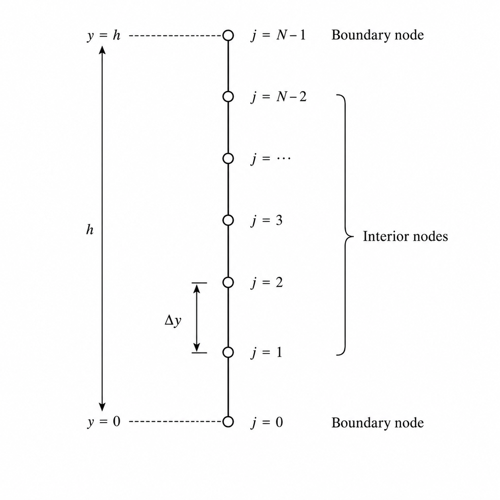

# Domain Discretization

To solve the governing diffusion equation numerically, the continuous spatial domain $0 \le y \le H$ is discretized into a finite number of grid points (nodes). Let $N$ represent the total number of nodes along the $y$-direction. The uniform distance between consecutive nodes, referred to as the grid spacing $\Delta y$, is defined as:

$$
\Delta y = \frac{H}{N-1}
$$

The discrete spatial coordinates of these grid points are given by:

$$
y_j = j \Delta y, \quad j = 0, 1, 2, \dots, N-1
$$

In alignment with C++ indexing standards, the index $j$ starts from $0$ (bottom wall) and ends at $N-1$ (top wall). The spatial discretization of the domain is illustrated in Figure [-@fig:computational-grid].

{#fig:computational-grid width=55% fig-pos="H"}

Similarly, the temporal domain is discretized into uniform intervals of $\Delta t$, where $n$ denotes the time level. The continuous velocity $u(y, t)$ at a specific grid location $y_j$ and time $t^n = n \Delta t$ is represented using the following discrete notation:

$$
u(y_j, t^n) \approx u_j^n
$$

This discrete representation serves as the foundation for approximating the partial derivatives in the governing equation using Finite Difference Methods (FDM).
