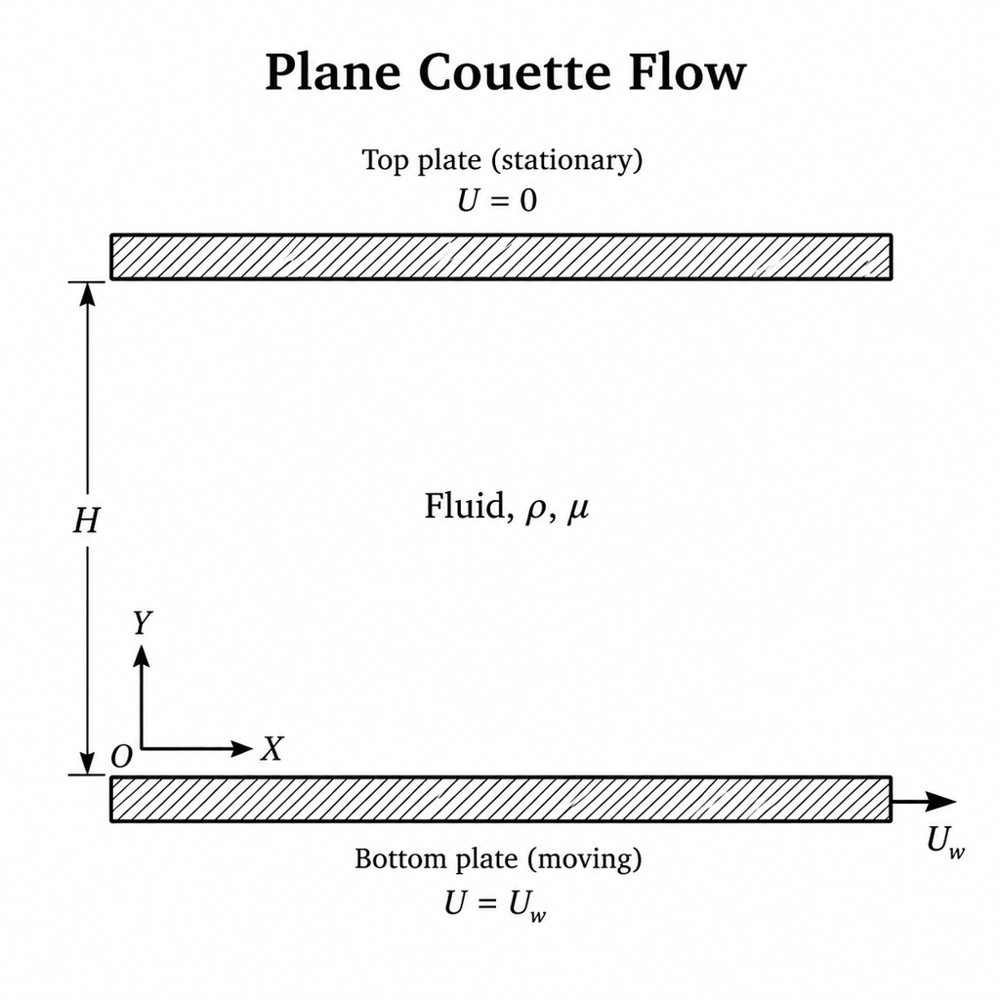

# Theoretical Background

## **Geometry**

The physical domain consists of two infinite parallel plates separated by a constant distance $H$. The coordinate system is defined such that the $x$-axis is aligned with the streamwise flow direction, and the $y$-axis is normal to the plates.

- **Domain:** $0 \le y \le H$ and $-\infty < x < \infty$
- **Top Plate ($y = H$):** Stationary (velocity $U = 0$)
- **Bottom Plate ($y = 0$):** Moving with a constant velocity $U_w$

{#fig:channel-geometry width=55% fig-pos="H"}

As illustrated in Figure [-@fig:channel-geometry], the fluid occupies the region between the two parallel plates, with the origin of the coordinate system located on the bottom plate.

## **Governing Equations**

To derive the mathematical model for plane Couette flow, the following assumptions are adopted:

1. The fluid is incompressible, and its density $\rho$ is constant.
2. The thermophysical properties of the fluid are constant, including the dynamic viscosity $\mu$.
3. The flow is one-dimensional; therefore, the velocity has only an $x$-component.
4. The plates are infinitely long in the flow direction.
5. No external pressure gradient is imposed in the streamwise direction, such that $\partial p / \partial x = 0$.
6. Gravitational effects and other body forces are neglected.

### Continuity Equation

The general form of the continuity equation is:

$$
\frac{\partial \rho}{\partial t}
+
\nabla \cdot (\rho \mathbf{V}) = 0
$$ {#eq:continuity-general}

For a two-dimensional Cartesian coordinate system, Equation ([-@eq:continuity-general]) is expressed as:

$$
\frac{\partial \rho}{\partial t}
+
\frac{\partial (\rho u)}{\partial x}
+
\frac{\partial (\rho v)}{\partial y}
= 0
$$ {#eq:continuity-2d}

Given that the density is constant, $\partial \rho / \partial t = 0$, Equation ([-@eq:continuity-2d]) reduces to:

$$
\frac{\partial u}{\partial x}
+
\frac{\partial v}{\partial y}
= 0
$$ {#eq:continuity-incompressible}

For the one-dimensional plane Couette flow considered here, the velocity field has only a streamwise component:

$$
\mathbf{V} = [u(y,t),\,0]
$$

Therefore, the velocity component normal to the plates is identically zero:

$$
v = 0
$$

Thus, Equation ([-@eq:continuity-incompressible]) simplifies to:

$$
\frac{\partial u}{\partial x}=0
$$ {#eq:continuity-simplified}

It follows from Equation ([-@eq:continuity-simplified]) that the streamwise velocity is independent of $x$ and can be written as:

$$
u = u(y,t)
$$

### Momentum Equation

For an incompressible Newtonian fluid with body-force effects neglected, the Navier–Stokes momentum equation is:

$$
\rho\left(
\frac{\partial \mathbf{V}}{\partial t}
+
\mathbf{V}\cdot\nabla \mathbf{V}
\right)
=
-\nabla p
+
\mu \nabla^2 \mathbf{V}
$$ {#eq:navier-stokes-vector}

Given the velocity field $\mathbf{V} = [u(y,t),\,0]$, the $x$-momentum component becomes:

$$
\rho\left(
\frac{\partial u}{\partial t}
+
u\frac{\partial u}{\partial x}
+
v\frac{\partial u}{\partial y}
\right)
=
-\frac{\partial p}{\partial x}
+
\mu\left(
\frac{\partial^2 u}{\partial x^2}
+
\frac{\partial^2 u}{\partial y^2}
\right)
$$ {#eq:navier-stokes-x}

Substituting the kinematic conditions:

$$
\frac{\partial u}{\partial x} = 0,
\qquad
v = 0,
\qquad
\frac{\partial^2 u}{\partial x^2} = 0
$$

together with the zero streamwise pressure gradient:

$$
\frac{\partial p}{\partial x} = 0
$$

into Equation ([-@eq:navier-stokes-x]) yields:

$$
\rho \frac{\partial u}{\partial t}
=
\mu \frac{\partial^2 u}{\partial y^2}
$$ {#eq:diffusion-dimensional}

Dividing Equation ([-@eq:diffusion-dimensional]) by the density gives the one-dimensional transient diffusion equation:

$$
\frac{\partial u}{\partial t}
=
\nu \frac{\partial^2 u}{\partial y^2}
$$ {#eq:diffusion-final}

where:

$$
\nu = \frac{\mu}{\rho}
$$

is the kinematic viscosity.

Additionally, the $y$-momentum equation reduces to:

$$
\frac{\partial p}{\partial y}=0
$$

which confirms that the pressure is uniform across the channel height.

## **Analytical Solution**

*(This section is reserved for the analytical solution comparison.)*

## **Initial and Boundary Conditions**

The initial and boundary conditions for the transient plane Couette flow problem are defined as follows.

### Initial Condition

At the initial time $t=0$, the fluid is at rest throughout the channel interior, while the bottom plate is already moving with the constant velocity $U_w$:

$$
u(0,0)=U_w
$$

$$
u(y,0)=0
\qquad
\text{for } 0<y\le H
$$

### Boundary Conditions

For $t\ge 0$, the velocity field satisfies the following Dirichlet boundary conditions:

$$
u(0,t)=U_w
$$

$$
u(H,t)=0
$$

The first condition represents the no-slip condition at the moving bottom plate, while the second condition represents the no-slip condition at the stationary top plate. Together, these conditions describe the impulsive start of the bottom plate and the subsequent transient diffusion of momentum across the channel.
